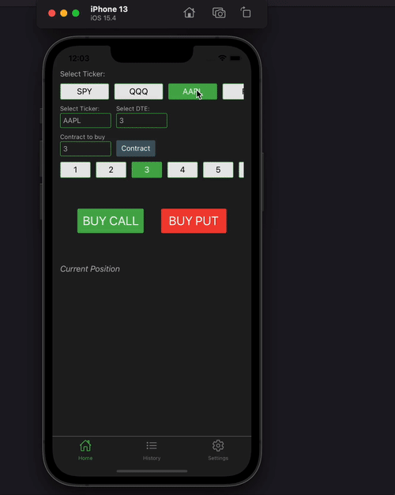
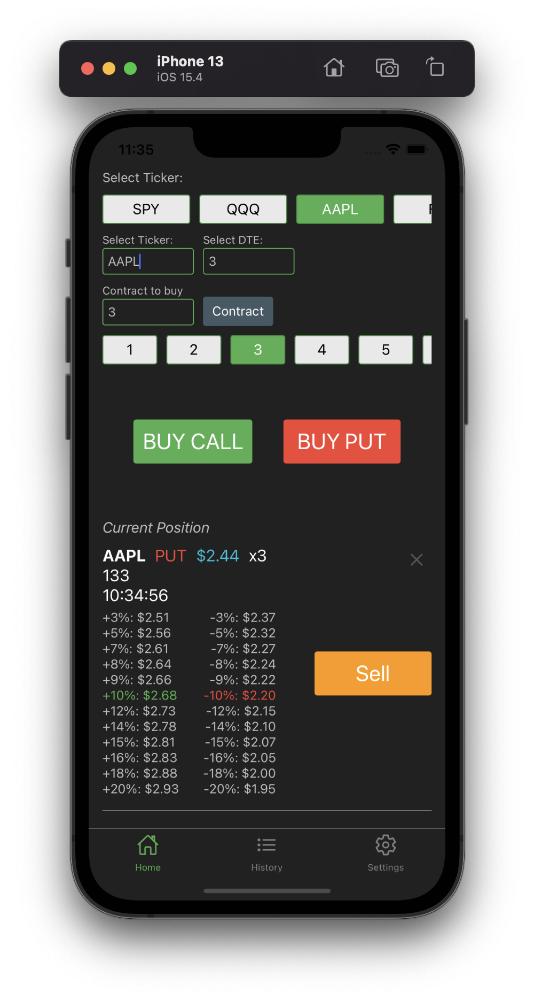
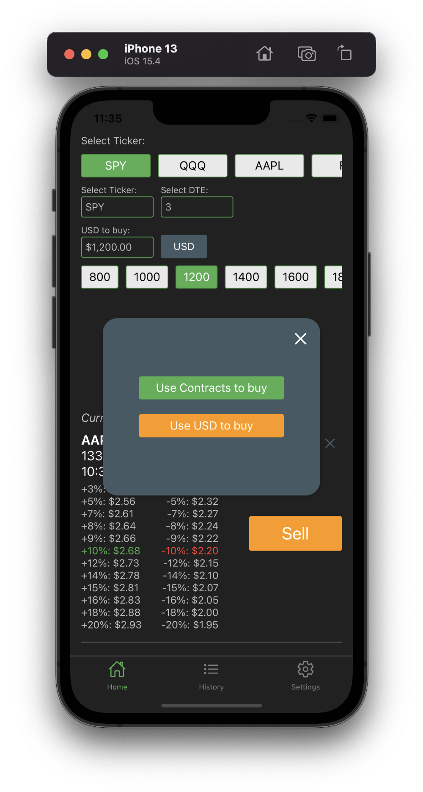
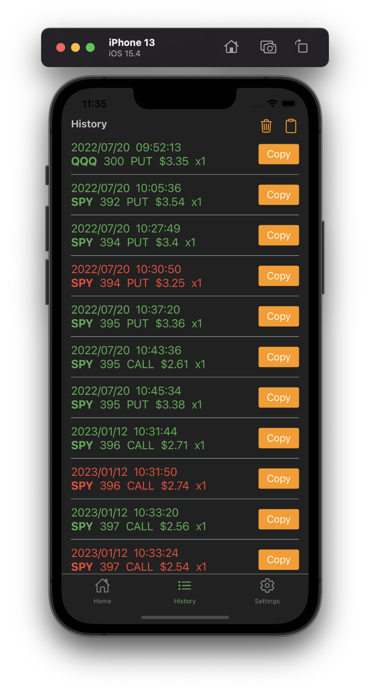

# Introduction

Quickly buy and sell at-the-money `Call` or `Put` options at market price with just one click on a mobile app, without having to navigate through options chains. This app utilizes client-side React Native code and server-side python code to execute orders through TWS or IB gateway.

One of the biggest challenges in day-trading is being able to quickly enter and exit trades. When anticipating a change in the price of a particular ticker, finding the at-the-money options strike, placing a quantity, and hitting the send button can take valuable seconds, and closing a trade can be just as time-consuming. This app eliminates this problem by allowing traders to quickly execute trades without the need to navigate through options chains, giving them more time to focus on chart reading and making informed decisions.

The goal of this app is to make quick and profitable trades by allowing traders to enter and exit positions fast. Traders can then take advantage of market fluctuations, and make the most of their time and money.

This repository contains the client-side code for the React Native app and the server-side code running on python that executes buy/sell orders through TWS or IB gateway.

<p align="middle">
  
</p>

<p float="left">
  
  
  
</p>


# Features

1. One-click button on your mobile app to easily execute buy and sell orders for at-the-money `Call` or `Put` options at market price.
2. Quickly select predefined tickers from a horizontal scroll list or type in a custom ticker.
3. Alter the DTE (days to expiry) of the contract you are interested in purchasing.
4. Choose to buy a fixed number of contracts or select an amount and let the server calculate the number of contracts to purchase based on real-time at-the-money option prices.
5. View at a glance the price at which the options need to hit for you to gain or lose a specific percentage.
6. View your purchase and sell history, and easily copy individual or all trades to your clipboard.

# Requirements

1. Python3
2. Nodejs
3. Either an iOS Simulator, or an Android Emulator, or a real physical device to run the app.
4. A running TWS or IB Gateway application. Make sure the API port is enabled and 'Download open orders on connection' is checked.
5. An IBKR account with market data subscription.

# Installation

1. Clone this project
2. Run `npm install` on root folder of project
3. Install Xcode so you can have iOS Simulator, or install Android Studio and download an Android Emulator
4. Run `npm run start` to start the metro bundler
5. Run `npm run ios` to install the app on an iOS Simulator, or run `npm run android` to install the app on an Android Emulator
6. Now, you are ready to run the app on your simulator.
7. To run the Backend server, make sure you have python3 installed, then run `pip3 install -r ./python-server/requirements.txt`. Thereafter, to start the server, run `python3 ./python-server/main.py`.

Optional:

1. If you want to run the React-native app on a physical device, please follow the [official document](https://reactnative.dev/docs/running-on-device).

# How it works

1. To start the app, run `npm run start`, which will launch a metro bundler that enables the React-Native application to run. The application will fetch the bundle to load from this server. In the mobile app, buying and selling options will send a `POST` request to a server (localhost on port `4000`)
2. The python server located in the folder `./python-server/main.py` will handle the requests at localhost on port `4000`. This python server communicates with TWS or IB gateway and sends the buy and sell requests there. TWS or IB gateway then sends the corresponding API calls to the IB server to execute the trade. It is important to note that a running TWS or IB Gateway application is required, and the API port must be enabled and 'Download open orders on connection' must be checked.
3. The orders are executed with the help of a running TWS or IB Gateway, so there is no need to input any authentication to your IBKR account in this program.

# Limitations

1. You must have a running TWS or IB gateway on your computer for the trade to go through.
2. You must have an account with real-time market subscription.
3. Only market buy/sell orders are supported at this moment.
4. Only at-the-money option strikes are supported at this moment.

# Configurations

Feel free to change the constants in `./configs.ts` to make changes to the default values. For example, if you want to put `BABA` as the default ticker on the app, change the value `AVAILABLE_TICKERS` in the config file.

# Credits
We use the following open source library to make this app possible:

1. [erdewit/ib_insync](https://github.com/erdewit/ib_insync)

# License and Disclaimer

```
ISC License

Copyright <YEAR> <OWNER>

Permission to use, copy, modify, and/or distribute this software for any purpose with or without fee is hereby granted, provided that the above copyright notice and this permission notice appear in all copies.

THE SOFTWARE IS PROVIDED "AS IS" AND THE AUTHOR DISCLAIMS ALL WARRANTIES WITH REGARD TO THIS SOFTWARE INCLUDING ALL IMPLIED WARRANTIES OF MERCHANTABILITY AND FITNESS. IN NO EVENT SHALL THE AUTHOR BE LIABLE FOR ANY SPECIAL, DIRECT, INDIRECT, OR CONSEQUENTIAL DAMAGES OR ANY DAMAGES WHATSOEVER RESULTING FROM LOSS OF USE, DATA OR PROFITS, WHETHER IN AN ACTION OF CONTRACT, NEGLIGENCE OR OTHER TORTIOUS ACTION, ARISING OUT OF OR IN CONNECTION WITH THE USE OR PERFORMANCE OF THIS SOFTWARE.
```

I do not provide personal investment advice and I am not a qualified licensed investment/financial advisor. The use of this software, as well as any interactions with me or comments made by me, whether in private or public, should not constitute financial advice or trading advice. Automated trading programs carry a particularly high risk due to their ungoverned nature. Any losses or gains made with one or more of these programs is your own responsibility. We takes no responsibility for any losses incurred or any malfunctions of the software on your account. Money lost by this program will not be refunded, as we are not liable for the transactions made in your accounts. As you are required to store your credentials for this program to execute trades, you are liable to the security of such credentials and will store these credentials in a safe and secure environment. Any lost of credentials due to the usage/attempt usage of this software will be your sole responsibility and we take no responsibility.
